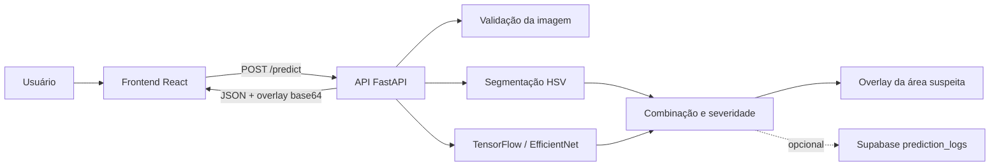
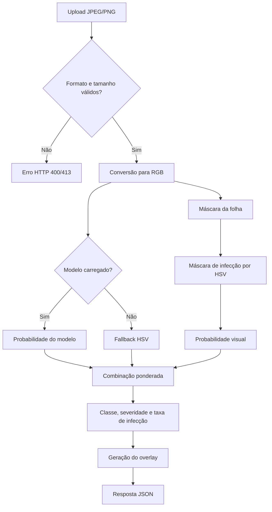
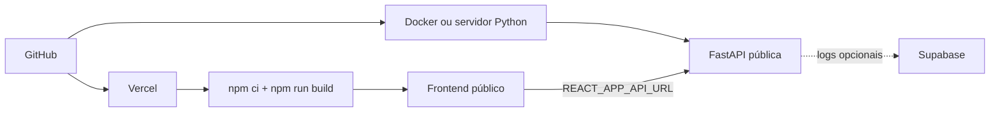

# Axios Cassava IA

Axios Cassava IA é uma aplicação para apoio à detecção de bacteriose em folhas de mandioca. O projeto combina uma API FastAPI, inferência com TensorFlow/EfficientNet, segmentação HSV para análise visual das lesões e uma interface React para envio de imagens e visualização do resultado.

> O sistema é uma ferramenta de apoio técnico. Ele não substitui avaliação agronômica, análise laboratorial ou diagnóstico profissional em campo.

## Stack Técnica

- **Frontend:** React 18 com Create React App.
- **Backend:** FastAPI, Uvicorn, TensorFlow CPU, OpenCV, Pillow e NumPy.
- **Modelo:** arquivos `.h5` versionados em `backend/models/` para manter a experiência de clone e execução local.
- **Banco opcional:** Supabase para registrar histórico de predições.
- **Deploy:** frontend na Vercel e backend em Docker ou servidor Python persistente.

## Arquitetura



## Fluxo de Predição



## Estrutura do Repositório

```text
backend/      API, configuração, modelos, treinamento e utilitários de imagem
frontend/     Interface React para upload e exibição dos resultados
supabase/     Migração SQL para logs opcionais de predição
DEPLOY.md     Guia de publicação
TROUBLESHOOTING.md
              Solução de problemas comuns
```

Arquivos gerados localmente, como `venv`, `node_modules`, logs, datasets e novos artefatos de treino, ficam fora do Git pelo `.gitignore`.

## Execução Local

### Pré-requisitos

- Python 3.10 ou superior.
- Node.js 18 ou superior.
- Git.

### Backend

```bash
cd backend
python -m venv venv
venv\Scripts\activate
pip install -r requirements.txt
copy .env.example .env
python -m uvicorn main:app --reload --host 0.0.0.0 --port 8000
```

### Frontend

Em outro terminal:

```bash
cd frontend
npm ci
npm start
```

Acesse:

- Frontend: `http://localhost:3000`
- API: `http://localhost:8000`
- Swagger/OpenAPI: `http://localhost:8000/docs`
- Health check: `http://localhost:8000/health`

Também é possível usar os scripts Windows mantidos no projeto:

```bat
setup_local.bat
run_local.bat
```

## Variáveis de Ambiente

Crie `backend/.env` a partir de `backend/.env.example`.

```bash
APP_ENV=development
PORT=8000
CORS_ORIGINS=http://localhost:3000,http://127.0.0.1:3000
MODEL_PATH=models/cassava_effnet.h5
CONFIDENCE_THRESHOLD=0.45
MODEL_WEIGHT=0.35
MIN_INFECTION_RATIO=0.02
MODEL_CONFIRMATION_RATIO=0.01
STRONG_MODEL_THRESHOLD=0.85
MAX_UPLOAD_MB=8
SUPABASE_URL=
SUPABASE_SERVICE_ROLE_KEY=
SUPABASE_PREDICTION_TABLE=prediction_logs
```

No frontend, configure a URL pública da API quando necessário:

```bash
REACT_APP_API_URL=http://localhost:8000/predict
```

Em produção, substitua por `https://URL-DO-SEU-BACKEND/predict`.

## Endpoints da API

| Método | Rota | Descrição |
| --- | --- | --- |
| `GET` | `/` | Informações básicas da API |
| `GET` | `/health` | Status, ambiente, modelo carregado e Supabase |
| `GET` | `/metrics` | Total de predições e tempo médio |
| `POST` | `/predict` | Recebe imagem e retorna classe, probabilidade, severidade e overlay |

## Supabase Opcional

A integração com Supabase registra cada predição na tabela `prediction_logs` quando as variáveis `SUPABASE_URL` e `SUPABASE_SERVICE_ROLE_KEY` estão configuradas no backend.

Execute a migração:

```sql
supabase/migrations/001_create_prediction_logs.sql
```

Mantenha `SUPABASE_SERVICE_ROLE_KEY` somente no backend. Nunca exponha essa chave em variáveis `REACT_APP_*` ou no navegador.

## Deploy



O guia completo está em [DEPLOY.md](DEPLOY.md).

## Testes e Verificação

```bash
python -m compileall backend
cd frontend
npm run build
```

Com backend e frontend rodando, execute:

```bash
python test_api.py
```

Se encontrar erro de ambiente, dependências, TensorFlow, CORS ou Supabase, consulte [TROUBLESHOOTING.md](TROUBLESHOOTING.md).

## Licença

Este projeto está licenciado conforme os termos descritos em [LICENSE](LICENSE).
